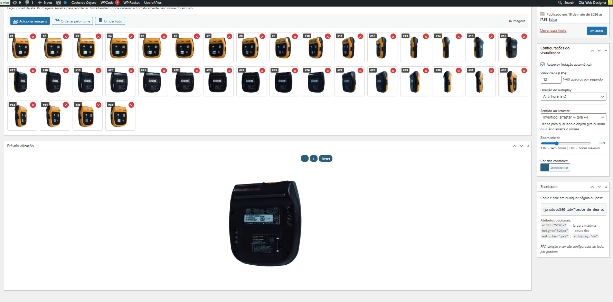
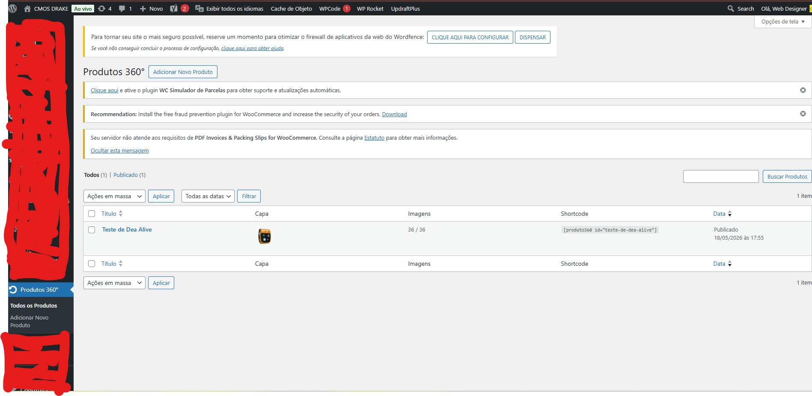

# Produto 360

[](https://wordpress.org/)
[](https://www.php.net/)
[](https://www.gnu.org/licenses/gpl-2.0)

Plugin WordPress para exibir produtos em rotação 360° com 36 imagens sequenciais. Visual moderno, suporte completo a mobile e múltiplos produtos independentes via shortcode.

---

## ✨ Recursos

- 🎯 **Custom Post Type dedicado** — cada produto 360° tem sua própria entrada
- 🖼️ **Upload via Media Library** — integração nativa do WordPress
- 🔀 **Drag-and-drop** para reordenar imagens
- 🔤 **Ordenação automática** pelo nome do arquivo
- 👁️ **Pré-visualização em tempo real** no painel administrativo
- 🏷️ **Shortcode exclusivo** por produto: `[produto360 id="meu-produto"]`
- ⚙️ **Configurações individuais** — autoplay, FPS, direção e cor por produto
- 📱 **Mobile-first** — drag, swipe e pinch zoom nativos
- 🚀 **Pré-carregamento otimizado** com loader visual
- 🔁 **Múltiplas instâncias** na mesma página sem conflitos
- 🎨 **Compatível** com Elementor, WooCommerce, Gutenberg e qualquer tema
- 🌐 **Sem dependências externas** — tudo roda local

## 📸 Screenshots

### Listagem de produtos 360°

*Menu **Produtos 360°** no admin mostra cada item com capa, status de imagens (X/36) e shortcode pronto para copiar.*

### Painel de edição completo

*Tudo numa só tela: upload com drag-and-drop das 36 imagens, configurações por produto (autoplay, FPS, sentido de rotação, zoom inicial 1.0x–3.0x, cor dos controles), pré-visualização ao vivo e shortcode pronto para uso.*

## 📦 Instalação

1. Baixe o ZIP em [Releases](../../releases) (ou clone este repo)
2. WordPress Admin → **Plugins → Adicionar novo → Enviar plugin**
3. Selecione `produto-360.zip` → **Instalar agora** → **Ativar**
4. Acesse o menu **Produtos 360°** que aparece na lateral

## 🚀 Uso

### 1. Criar um produto

1. Menu lateral → **Produtos 360°** → **Adicionar Novo**
2. Dê um título (ex: "Sapato Premium")
3. Clique em **Adicionar imagens** e selecione suas 36 fotos
4. Arraste para reordenar (ou use **Ordenar pelo nome**)
5. Configure autoplay, FPS, cor (lateral direita)
6. **Publicar**

### 2. Copiar o shortcode

Após publicar, o shortcode aparece na lateral. Exemplo:

```
[produto360 id="sapato-premium"]
```

### 3. Inserir em qualquer lugar

- **Página/Post:** cole o shortcode no editor
- **Elementor:** use o widget *Shortcode*
- **WooCommerce:** insira na descrição do produto
- **Tema:** use `do_shortcode()` em PHP

## ⚙️ Atributos do shortcode

| Atributo | Valor padrão | Descrição |
|----------|-------------|-----------|
| `id` | — (obrigatório) | Slug do produto (ex: `produto-a`) ou ID numérico |
| `width` | `520px` | Largura máxima (px, %, em, rem, vw, vh) |
| `height` | — | Altura fixa opcional (se omitida, usa proporção 1:1) |
| `autoplay` | configuração do produto | `yes` ou `no` (sobrescreve admin) |
| `class` | — | Classe CSS extra |

> 💡 **FPS, direção e cor** dos controles são configurados na admin de cada produto.

### Exemplos

```
[produto360 id="produto-a"]
[produto360 id="produto-a" width="100%"]
[produto360 id="produto-a" width="600px" height="600px"]
[produto360 id="produto-a" autoplay="no"]
```

## 🎮 Controles do visualizador

| Dispositivo | Ação | Efeito |
|-------------|------|--------|
| Desktop | Arrastar mouse | Girar |
| Desktop | Scroll do mouse | Zoom |
| Desktop | Botões `+` / `−` / Reset | Zoom |
| Mobile | Swipe com 1 dedo | Girar |
| Mobile | Pinça com 2 dedos | Zoom |

## 📋 Requisitos

- WordPress 5.5 ou superior
- PHP 7.2 ou superior

## 🛠️ Estrutura do projeto

```
produto-360/
├── produto-360.php              # Bootstrap do plugin
├── uninstall.php                # Limpeza ao desinstalar
├── readme.txt                   # Padrão WordPress.org
├── includes/
│   ├── class-p360-post-type.php # Custom Post Type
│   ├── class-p360-shortcode.php # Renderização do shortcode
│   └── class-p360-assets.php    # Enqueue inteligente
├── admin/
│   ├── class-p360-admin.php     # Meta boxes e colunas
│   ├── css/p360-admin.css
│   └── js/p360-admin.js         # Sortable + Media Library
├── public/
│   ├── css/p360-viewer.css      # Visual do viewer
│   └── js/p360-viewer.js        # Classe P360Viewer
└── languages/
```

## 🧪 Tecnologias

- **PHP OOP** com namespacing por prefixo (`P360_`)
- **Custom Post Type** + post meta para armazenamento
- **WP Media Library** via `wp.media`
- **jQuery UI Sortable** para drag-and-drop
- **Vanilla JS** (sem dependências) no front-end
- **CSS Custom Properties** para temização

## 📝 Changelog

### 1.1.0
- 🔍 **Zoom inicial** configurável por produto (slider 1.0x – 3.0x)
- 🔄 **Sentido do arrasto** configurável (natural / invertido)
- Botão "Reset" agora volta ao zoom inicial configurado
- Direção do autoplay e sentido de arrasto agora são independentes

### 1.0.0
- Lançamento inicial

## 📄 Licença

GPL v2 ou posterior — veja [LICENSE](LICENSE).

## 👤 Autor

**Marcelo Viana de Andrade**

---

⭐ Se este plugin foi útil, deixe uma estrela no repositório!
